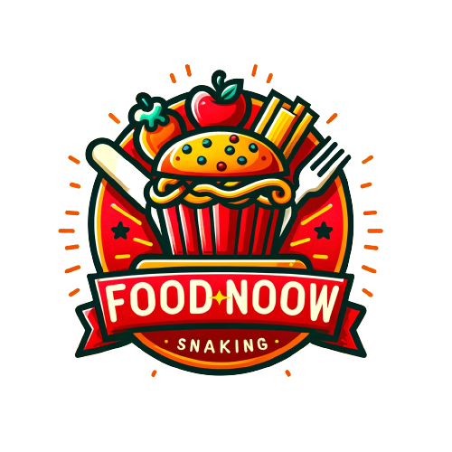

<p align="center">
  
</p>

# FoodNoow

Bem-vindo ao repositório do FoodNoow, uma plataforma inovadora para restaurantes divulgarem seus menus e serviços. Este projeto é desenvolvido com tecnologias de ponta para oferecer uma experiência de usuário excepcional e uma interface administrativa eficiente. Para acessar entre em [FoodNoow](https://www.foodnoow.com.br)

## Tecnologias Utilizadas

- **React**: Uma biblioteca JavaScript para construir interfaces de usuário.
- **Next.js**: Um framework React que possibilita funcionalidades como Server Side Rendering e Static Site Generation.
- **Tailwind CSS**: Um framework CSS para design rápido e responsivo.
- **DynamoDB**: Um banco de dados NoSQL da AWS, escalável e de alta performance.

## Como Começar

Para rodar o projeto localmente, siga estes passos:

```bash
npm run dev
# ou
yarn dev
# ou
pnpm dev
# ou
bun dev
